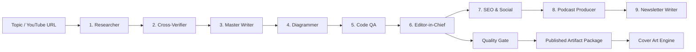

# CrewAI Content Engine

> **Turn a YouTube video or topic into a fact-checked, publication-ready content package with a coordinated CrewAI agent pipeline.**

[](https://www.python.org/)
[](https://www.crewai.com/)
[](https://fastapi.tiangolo.com/)
[](https://docs.pytest.org/)
[](https://pypi.org/project/pip-audit/)

**CrewAI Content Engine** is a production-oriented multi-agent content system that researches technical YouTube content, verifies claims, writes and reviews an article, generates diagrams, checks code, and prepares the final package for multiple distribution channels.

It combines **CrewAI orchestration, Google AI Studio/Gemini, FastAPI, persistent job processing, worker leases, replayable events, quality gates, and security controls** in one repository.

---

## ✨ What it does

Give the engine a **topic, YouTube URL, or channel context** and the pipeline can produce:

- 📝 Long-form technical blog content
- 🔎 Research and evidence-backed verification
- 🧩 Mermaid architecture and workflow diagrams
- 🧪 Code quality checks for generated snippets
- ✍️ Editorially reviewed final content
- 📈 SEO metadata and social distribution copy
- 🎙️ Podcast dialogue / voiceover scripts
- 📧 Newsletter / Substack-ready copy
- 🎨 AI-generated 1200×630 cover artwork
- 📦 Exportable Markdown and HTML artifacts
- 🔗 Optional webhook delivery to downstream automation

The important distinction is that this is **not a single prompt calling an LLM**. It is a coordinated workflow where specialized agents hand structured work to the next stage.

---

## 🧠 The 9-agent pipeline



### Agent responsibilities

| # | Agent | Responsibility |
|---|---|---|
| 1 | **Content Researcher** | Extracts transcripts and builds the technical research brief. |
| 2 | **Cross-Verifier** | Cross-checks claims, benchmarks, APIs, and technical statements against external evidence. |
| 3 | **Master Writer** | Converts the verified brief into a structured long-form article. |
| 4 | **Architecture Diagrammer** | Creates Mermaid diagrams for systems, workflows, and technical architecture. |
| 5 | **Code QA Inspector** | Reviews generated code, dependencies, typing, and implementation quality. |
| 6 | **Editor-in-Chief** | Reconciles research, writing, diagrams, and QA into the final master article. |
| 7 | **SEO & Social Strategist** | Creates SEO metadata, LinkedIn copy, X/Twitter threads, tags, and summaries. |
| 8 | **Podcast Producer** | Converts the final subject into conversational podcast or voiceover scripts. |
| 9 | **Newsletter Strategist** | Creates newsletter-ready editions for email distribution. |

### Supporting systems

- **Memory layer** — short-term, long-term, and entity-aware context for agent continuity.
- **Quality gate** — deterministic post-generation scoring for factuality, source quality, readability, SEO, and code quality.
- **Cover Art Engine** — generates a consistent 1200×630 hero image.
- **Persistent Job Store** — stores job state and replayable events in SQLite.
- **Worker Lease System** — prevents stale workers from completing or failing jobs after recovery.
- **Attempt Isolation** — prevents stale executions from overwriting replacement artifacts.

---

## 🏗️ Production architecture

The application separates the HTTP/API layer from long-running CrewAI execution.

```text
                         ┌──────────────────────┐
                         │      Web Studio      │
                         │  Browser / Frontend  │
                         └──────────┬───────────┘
                                    │
                                    ▼
                         ┌──────────────────────┐
                         │       FastAPI        │
                         │   Job/API Gateway    │
                         └──────────┬───────────┘
                                    │
                                    ▼
                         ┌──────────────────────┐
                         │    SQLite Job Store  │
                         │ Queue + State + SSE  │
                         └──────────┬───────────┘
                                    │
                    ┌───────────────┼───────────────┐
                    ▼               ▼               ▼
               ┌────────┐      ┌────────┐      ┌────────┐
               │Worker 1│      │Worker 2│      │Worker N│
               └────┬───┘      └────┬───┘      └────┬───┘
                    │               │               │
                    └───────────────┼───────────────┘
                                    ▼
                         ┌──────────────────────┐
                         │   CrewAI 9-Agent     │
                         │       Pipeline       │
                         └──────────┬───────────┘
                                    │
                                    ▼
                         ┌──────────────────────┐
                         │ Quality + Artifacts  │
                         │  Per-attempt output  │
                         └──────────────────────┘
```

### Why the worker architecture matters

A CrewAI generation can take significantly longer than a normal HTTP request. The API therefore creates a job and returns immediately instead of keeping one request open for the entire generation.

Workers then claim jobs independently.

Each claim receives a **unique lease token**. Heartbeats, completion, and failure operations are fenced by that lease.

If a worker becomes stale:

1. The job can be recovered.
2. A replacement worker receives a new lease.
3. The stale worker can no longer complete or fail the job.
4. Its output is isolated in its own attempt directory.
5. The replacement worker's artifacts remain protected.

This prevents a classic distributed-worker race where an old worker finishes after recovery and overwrites the new result.

---

## ⚡ Job lifecycle

```text
POST /api/jobs
      │
      ▼
   queued
      │
      ▼
 worker claims lease
      │
      ▼
   running
      │
      ├── heartbeat ──► lease remains valid
      │
      ▼
  9-agent execution
      │
      ▼
 quality gate + artifacts
      │
      ▼
  completed
```

If execution fails, the job can retry up to its configured retry limit.

If a worker disappears, heartbeat recovery can requeue the job.

### Public job endpoints

| Endpoint | Purpose |
|---|---|
| `POST /api/jobs` | Create an asynchronous generation job. |
| `GET /api/jobs` | List jobs. |
| `GET /api/jobs/{job_id}` | Inspect job status. |
| `GET /api/jobs/{job_id}/events` | Replay/stream persisted job events through SSE. |
| `GET /api/jobs/{job_id}/artifacts` | Retrieve generated artifacts. |
| `GET /api/jobs/{job_id}/timeline` | Replay the persisted lifecycle timeline for debugging and observability. |
| `GET /api/jobs/{job_id}/metrics` | Return duration, retries, event counts, and lifecycle metrics. |
| `POST /api/generate` | Compatibility endpoint returning the job contract. |
| `POST /api/youtube/inspect` | Inspect a YouTube URL. |
| `POST /api/youtube/search` | Search available YouTube sources. |
| `POST /api/generate-cover` | Generate cover artwork. |

---

## 🛡️ Security and reliability

The repository includes production-minded controls around the API and worker system.

### API security

- API keys are never returned by the settings endpoint.
- Administrative operations are protected by local-admin checks.
- Remote administrative access can require `APP_API_TOKEN`.
- CORS defaults to localhost origins.
- Pydantic request models enforce input size and enum constraints.
- Webhook destinations are validated against unsafe/private network targets.
- Webhook redirects are disabled to reduce SSRF exposure.

### Worker safety

- Atomic SQLite job claiming.
- Unique per-worker lease tokens.
- Lease-fenced heartbeat, completion, and failure operations.
- Stale-worker recovery.
- Bounded retries.
- Per-job artifact directories.
- Per-attempt artifact isolation.
- Stale-worker completion/failure regression tests.

### Important operational principle

> **A worker must prove it still owns the current lease before changing job state.**

That invariant is the core protection against stale-worker races.

---

## 📁 Project structure

```text
crewai-content-engine/
│
├── agents.py                 # Agent definitions
├── tasks.py                  # CrewAI task definitions
├── crew.py                   # Crew assembly + memory configuration
├── tools.py                  # YouTube/source tools
├── worker.py                 # Persistent background worker
├── job_store.py              # SQLite queue, leases, events and recovery
├── models.py                 # Typed Pydantic contracts
├── quality_gate.py            # Deterministic content quality scoring
├── security.py               # API/admin/webhook security controls
├── image_gen.py              # Cover-art generation
├── app.py                    # FastAPI application
│
├── static/
│   ├── index.html            # Web Studio UI
│   ├── style.css             # UI styling
│   └── app.js                # Frontend logic + SSE client
│
├── tests/
│   ├── test_jobs.py          # Worker lifecycle + lease fencing
│   ├── test_models.py        # Data contract validation
│   ├── test_quality_gate.py  # Quality-gate tests
│   └── test_security.py      # Security boundary tests
│
├── .github/workflows/
│   ├── ci.yml                # Python test/quality workflow
│   ├── security.yml          # Dependency security scanning
│   ├── docker.yml            # Container build + health smoke test
│   └── run-ai-evaluation.yml # Manual AI evaluation benchmark
├── Dockerfile                # Production API container
├── docker-compose.yml        # API + worker local deployment
├── .dockerignore

│
├── requirements.txt
├── .env.example
└── README.md
```

Runtime data is kept under `artifacts/` and excluded from version control.

---

## 🚀 Quick start

### 1. Clone

```bash
git clone https://github.com/mightyalok00/crewai-content-engine.git
cd crewai-content-engine
```

### 2. Create a virtual environment

**Windows**

```bash
python -m venv venv
venv\Scripts\activate
```

**macOS / Linux**

```bash
python3 -m venv venv
source venv/bin/activate
```

### 3. Install dependencies

```bash
python -m pip install --upgrade pip
pip install -r requirements.txt
```

### 4. Configure environment variables

Copy the template:

```bash
copy .env.example .env
```

On macOS/Linux:

```bash
cp .env.example .env
```

Configure your Google AI Studio/Gemini credentials and model:

```env
GEMINI_API_KEY=your_gemini_api_key
GOOGLE_API_KEY=your_gemini_api_key
MODEL_NAME=gemini/gemini-3.8-flash

CREW_MEMORY_ENABLED=true
EMBEDDER_PROVIDER=onnx

APP_API_TOKEN=
CORS_ALLOW_ORIGINS=http://localhost:8000,http://127.0.0.1:8000

JOB_DB_PATH=artifacts/jobs.sqlite3
JOB_POLL_SECONDS=2
JOB_RECOVERY_SECONDS=300
WORKER_ID=worker-1
```

> Never commit `.env` or real API credentials.

---

## 🐳 Run with Docker

Build and start the API container:

```bash
docker build -t crewai-content-engine .
docker run --env-file .env -p 8000:8000 -v "$(pwd)/artifacts:/app/artifacts" crewai-content-engine
```

For the API + worker setup, use:

```bash
docker compose up --build
```

The API exposes two operational probes:

- `GET /health` — liveness probe for the HTTP process.
- `GET /ready` — readiness probe that verifies the persistent job store is reachable.

The Docker workflow builds the image and performs a real HTTP health smoke test on every pull request.

## ▶️ Run the system

### Recommended: API + worker

Terminal 1:

```bash
python app.py
```

Terminal 2:

```bash
python worker.py
```

Open:

```text
http://localhost:8000
```

The browser UI submits a job to FastAPI while the worker performs the long-running CrewAI execution.

### CLI mode

For direct execution without the web studio:

```bash
python crew.py
```

With a custom topic and channel:

```bash
python crew.py "LangChain vs CrewAI" "@freecodecamp"
```

---

## 🔁 Running multiple workers

For higher local throughput, run multiple workers with unique IDs.

**Windows PowerShell**

```powershell
$env:WORKER_ID="worker-1"; python worker.py
$env:WORKER_ID="worker-2"; python worker.py
```

**macOS/Linux**

```bash
WORKER_ID=worker-1 python worker.py
WORKER_ID=worker-2 python worker.py
```

SQLite coordinates job ownership atomically, while leases prevent stale workers from mutating jobs they no longer own.

For larger deployments, the job-store interface can evolve toward a PostgreSQL/Redis-backed queue without changing the public job API.

---

## ▶️ GitHub Actions run buttons

You can run the automated checks directly from GitHub.

### CI

[](https://github.com/mightyalok00/crewai-content-engine/actions/workflows/ci.yml)

The **CI** workflow runs automatically on pull requests and pushes to `main`, and can also be started manually from the **Actions** tab.

### AI Evaluation

[](https://github.com/mightyalok00/crewai-content-engine/actions/workflows/run-ai-evaluation.yml)

Open **Actions → Run AI Evaluation → Run workflow** to execute the evaluation benchmark manually. You can set the minimum score threshold before starting the run.

The workflow also uploads the resulting `evaluation-report.json` as a downloadable GitHub Actions artifact.

## 🧪 Testing

Run the full test suite:

```bash
pytest -q
```

The test suite covers:

- Job creation and persistence
- Atomic worker claiming
- Heartbeat behavior
- Retry and failure handling
- Event persistence and replay
- Artifact persistence
- Stale-worker recovery
- Lease-fenced completion
- Lease-fenced failure
- Pydantic model validation
- Quality-gate behavior
- API security boundaries

CI runs automated checks against supported Python versions defined by the workflow.

Dependency security scanning is also configured through GitHub Actions.

---

## 📦 Output package

A successful run can produce a content package containing:

```text
artifacts/
└── <job-id>/
    └── attempt-<retry>-<lease>/
        ├── new_blog_post.md
        ├── social_snippets.md
        ├── podcast_script.md
        ├── newsletter.md
        └── ...
```

This structure makes each execution traceable and prevents concurrent or stale attempts from sharing the same output directory.

---

## 🎯 Design goals

This project is built around five engineering principles:

### 1. Specialized agents over one giant prompt
Each stage has a clear responsibility and output contract.

### 2. Evidence before publication
The writer receives a research and verification layer instead of relying only on raw model generation.

### 3. Asynchronous execution
Long-running AI workflows are handled as jobs rather than blocking API requests.

### 4. Correctness under worker failure
Heartbeats, recovery, leases, and attempt isolation protect the job lifecycle.

### 5. Production-minded observability
Persisted job events make progress replayable and easier to inspect.


---

## 🧪 AI Evaluation & Evidence Quality

The engine now includes a deterministic evaluation layer that scores generated content before it is treated as a quality-gated artifact.

### Evaluation dimensions

| Dimension | What it checks |
|---|---|
| **Evidence coverage** | Verified claims, source presence, and evidence confidence |
| **Verification** | Verification score, warnings, and unsupported claims |
| **Structure** | H1, section structure, and minimum content organization |
| **Code quality** | Code-fence language coverage and non-empty snippets |

The evaluator produces a machine-readable report:

```json
{
  "overall": 0.93,
  "passed": true,
  "scores": {
    "evidence_coverage": 0.965,
    "verification": 0.95,
    "structure": 1.0,
    "code_quality": 1.0
  },
  "notes": []
}
```

Run it against a generated article:

```bash
python -m evaluation.run_evaluation \
  artifacts/<job-id>/attempt-<retry>-<lease>/new_blog_post.md \
  --verification verification.json \
  --output evaluation.json
```

The same evaluator is integrated into `quality_gate.py`, so content quality is now based on both the existing publication heuristics and evidence-aware evaluation.

### Operational observability

The API exposes a replayable job timeline and dependency-free operational metrics. This makes long-running AI executions inspectable without requiring an external monitoring stack.

```text
GET /api/jobs/<job-id>/metrics

status              completed
retry_count         0
duration_seconds    155.3
event_count         8
status_transitions  queued=1, running=1, completed=1
```

Every HTTP response also includes an `X-Request-ID` correlation header so API requests can be connected to application logs and support investigations.

### Why this matters

Traditional unit tests can prove that the software works. They cannot prove that an AI-generated article is trustworthy.

This evaluation layer creates a repeatable quality signal that can be expanded with:

- LLM-as-a-judge evaluators
- Human preference datasets
- Factuality benchmarks
- Citation precision/recall
- Model and prompt regression tracking
- Cost/quality comparisons across providers

The CI pipeline runs a deterministic evaluation benchmark on every supported Python version.


---

## 🗺️ Roadmap

- [x] 9-agent CrewAI pipeline
- [x] YouTube research workflow
- [x] Cross-verification stage
- [x] Code QA stage
- [x] SEO/social generation
- [x] Podcast and newsletter outputs
- [x] AI cover generation
- [x] FastAPI web studio
- [x] Persistent asynchronous jobs
- [x] SQLite worker queue
- [x] Heartbeat recovery
- [x] Worker lease fencing
- [x] Per-attempt artifact isolation
- [x] Automated tests and CI
- [x] Dependency security workflow
- [ ] Pluggable PostgreSQL/Redis job backend
- [ ] Distributed object storage for artifacts
- [ ] Advanced run observability and metrics
- [ ] More publishing integrations

---

## 🤝 Contributing

Contributions are welcome.

A good contribution should:

1. Keep agent responsibilities clearly separated.
2. Preserve typed contracts where practical.
3. Include tests for behavior changes.
4. Avoid committing secrets or runtime artifacts.
5. Preserve worker lease and artifact-isolation guarantees.
6. Update documentation when architecture or API behavior changes.

---

## 📄 License

See the repository for the current license and project terms.

---

## 🔗 Project

**GitHub:** https://github.com/mightyalok00/crewai-content-engine

**Built with:** Python · CrewAI · FastAPI · Gemini · Pydantic · SQLite · pytest

> **From video → research → verification → writing → QA → distribution.**
>
> **One coordinated content engine.**
