# 🤖 CrewAI YouTube-to-Blog Multi-Agent System (Google AI Studio Edition v3.5)

An automated 9-agent autonomous workflow built with **CrewAI** that transcribes, analyzes, drafts, fact-checks & code-reviews technical YouTube videos into publish-ready blog posts, generates 1200x630 HD cover banner art, and creates viral SEO & social media distribution kits using the **Google AI Studio Gemini API**.

---

## 🏗️ 9-Agent Architecture & Workflow

```mermaid
graph LR
    User[Topic / YouTube URL / Channel] --> Researcher[1. Senior Content Researcher]
    Researcher -->|Extracts Transcript & Insights| YT[YouTube Universal Tool]
    YT -->|Raw Video Insights| Researcher
    Researcher -->|Structured Brief| Verifier[2. Web & Benchmark Cross-Verifier]
    Verifier --> Writer[3. Senior Content Writer]
    Writer --> Diagrammer[4. Mermaid Architecture Diagrammer]
    Diagrammer --> CodeQA[5. Code QA Sandbox]
    CodeQA --> Editor[6. Editor-in-Chief]
    Editor --> SEO[7. SEO & Social Specialist]
    SEO --> Podcast[8. Podcast Audio Producer]
    Podcast --> Newsletter[9. Substack Newsletter Copywriter]
    Newsletter --> Output[Multi-Channel Markdown Artifacts]
    Output --> CoverGen[🎨 AI Cover Art Engine]
```



1. **Researcher Agent (`blog_researcher`)**: Uses `yt_tool` to locate video transcripts and extract deep technical insights.
2. **Cross-Verification Agent (`cross_verifier_agent`)**: Cross-checks facts, benchmark numbers, and API syntax against documentation.
3. **Writer Agent (`blog_writer`)**: Transforms technical insights into a comprehensive draft markdown blog post.
4. **Diagrammer Agent (`diagram_agent`)**: Generates production-ready Mermaid.js architecture diagrams and workflow visualizers.
5. **Code QA Agent (`code_qa_agent`)**: Validates code snippets, adds type annotations and dependencies.
6. **Editor-in-Chief (`editor_agent`)**: Integrates diagrams, code, and narrative into a finalized master post.
7. **SEO & Social Specialist Agent (`seo_social_agent`)**: Converts the finalized article into viral LinkedIn posts, Twitter/X threads, high-intent SEO tags, and executive summaries.
8. **Podcast Audio Producer (`podcast_agent`)**: Crafts 2-host conversational dialogue and solo voiceover scripts.
9. **Newsletter Copywriter (`newsletter_agent`)**: Writes high-converting email newsletter editions.
10. **AI Cover Art Generator (`image_gen.py`)**: Automatically renders a 1200x630 HD hero banner in 4 selectable aesthetic styles.
11. **Contextual Memory Engine**:
    - **Short-Term Memory**: Shared RAG context between agents during task execution.
    - **Long-Term Memory**: Historical knowledge and previous article insights preserved across sessions.
    - **Entity Memory**: Identifies technical terms, authors, and frameworks for consistency.
    - **Embedder Support**: Local zero-cost ONNX embeddings (default), Google AI embeddings, or OpenAI embeddings.

---

## 📁 Project Structure

```text
├── .env.example          # Environment variables template
├── .env                  # Local Google AI Studio & Memory configuration
├── requirements.txt      # Python dependencies
├── tools.py              # YouTube Transcript & Channel Extraction Tool
├── agents.py             # 9 Autonomous CrewAI Agents
├── tasks.py              # 9 Sequenced CrewAI Tasks
├── image_gen.py          # AI Banner & Cover Art Generation Engine (1200x630 HD)
├── crew.py               # Assembles 9-Agent Crew with multi-tier memory
├── app.py                # FastAPI Web Server with Memory API, Cover Gen & Exports
├── static/
│   ├── index.html        # Glassmorphic UI with 9-Agent Visualizer, Cover Studio & Social Kit
│   ├── style.css         # Styling, Cover Studio Grid & Layout
│   └── app.js            # Real-time SSE streams, 9-Agent transitions & Webhooks
├── new_blog_post.md      # Generated blog article output
├── social_snippets.md    # Generated SEO & Social Media Kit
├── podcast_script.md     # Generated Podcast Dialogue Script
└── newsletter.md         # Generated Email Newsletter Issue
```

---

## 🚀 Quickstart Guide

### 1. Create and Activate Virtual Environment

```bash
# Using venv
python -m venv venv
venv\Scripts\activate   # On Windows
```

### 2. Install Dependencies

```bash
pip install -r requirements.txt
```

### 3. Configure Google AI Studio / Gemini API Key

Edit [.env](file:///e:/crew/.env) and set your Gemini API key:

```env
GEMINI_API_KEY=AQ.xxxxxxxxxxxxxxxxxxxxxxxxxxxxxxxxxxxxxxxx
GOOGLE_API_KEY=AQ.xxxxxxxxxxxxxxxxxxxxxxxxxxxxxxxxxxxxxxxx
MODEL_NAME=gemini/gemini-3.8-flash
```

---

## 💻 Running the Application

### Option A: Interactive Web UI Studio (Recommended)

Start the modern web studio:

```bash
python app.py
```

Then open **[http://localhost:8000](http://localhost:8000)** in your browser to:

- 🎯 **Topic & Source Selector**: Switch channels (`@krishnaik06`, `@freecodecamp`, `@lexfridman`, `@hubermanlab`) or enter direct YouTube URLs.
- ⚡ **Real-Time 9-Agent Flow**: Watch live animated node status indicators and terminal logs via Server-Sent Events.
- 📱 **SEO & Social Media Kit**: 1-click copy formatted LinkedIn posts, Twitter/X threads, and SEO tags.
- 🎙️ **Podcast Studio**: Synthesize and listen to 2-host audio scripts with browser speech synthesis.
- 📧 **Newsletter Suite**: Export ready-to-send Substack and Beehiiv email campaigns.
- 📤 **Export Suite**:
  - Download `.md` raw Markdown.
  - Download standalone styled `.html` with code syntax highlighting.
  - 🖨️ Clean print or save as `.pdf`.
  - 🚀 Dispatch directly to any Webhook (Zapier, Make, n8n, Slack, Dev.to).

---

### Option B: Command-Line Interface (CLI)

Run with the default topic and channel:

```bash
python crew.py
```

Or pass custom topic and channel arguments:

```bash
python crew.py "LangChain vs CrewAI" "@freecodecamp"
```


## 🛡️ Production Engineering Upgrade

The project now includes a production-hardening layer while keeping the existing Studio UI and 9-agent workflow intact.

### Security
- API keys are never returned by GET /api/settings; the response exposes only api_key_configured.
- Admin/settings/export/webhook operations are localhost-restricted by default.
- Remote admin access requires APP_API_TOKEN and a Bearer token.
- CORS defaults to localhost origins instead of wildcard access.
- Webhook URLs are validated against private, loopback, link-local, multicast, and reserved addresses.
- Webhook redirects are disabled to reduce SSRF risk.
- Request models enforce size and enum constraints with Pydantic.

### Quality Engineering
- models.py provides typed contracts for research, evidence, verification, quality reports, and artifacts.
- quality_gate.py provides a deterministic post-generation quality score and blockers for future regeneration loops.
- tests/ covers the security boundary, Pydantic validation, and quality-gate behavior.
- .github/workflows/ci.yml runs syntax checks and tests on Python 3.11 and 3.12.
- .github/workflows/security.yml runs scheduled pip-audit dependency checks.

### Local configuration
Copy .env.example to .env. For a local-only installation, leave APP_API_TOKEN empty. If the application is exposed through a reverse proxy or network interface, set a strong token and restrict the proxy/firewall as well.

## ⚡ Asynchronous Job API

Generation now supports request-scoped jobs instead of forcing clients to keep a single HTTP request open for the entire CrewAI run.

### Flow
`POST /api/jobs` → returns `job_id` → `GET /api/jobs/{job_id}` for status → `GET /api/jobs/{job_id}/events` for SSE logs → `GET /api/jobs/{job_id}/artifacts` for generated outputs.

The legacy `POST /api/generate` endpoint remains available and now returns the same `job_id` contract, allowing the existing frontend to migrate incrementally.

Generated artifacts are stored under `artifacts/{job_id}/attempt-{retry}-{lease}/`. Each worker execution attempt gets its own directory, preventing a stale worker from overwriting a replacement worker's files.


## 🧵 Persistent Worker Architecture

Generation is now decoupled from the FastAPI process.

### Production flow

~~~text
Client
  │
  ▼
FastAPI ──► SQLite Job Store
                 │
                 ▼
          Persistent Job Queue
                 │
          ┌──────┴──────┐
          ▼             ▼
      Worker 1       Worker 2
          │             │
          └──────┬──────┘
                 ▼
             CrewAI 9-Agent
                 │
                 ▼
      artifacts/{job_id}/attempt-*/
~~~

### Worker behavior

Run the API and worker separately:

~~~bash
python app.py
python worker.py
~~~

Each worker executes one CrewAI job at a time. To increase throughput, run additional worker processes with unique `WORKER_ID` values. SQLite atomically claims queued jobs so two workers cannot claim the same job.

The job store provides:
- **Persistent state** in SQLite instead of process memory.
- **Replayable SSE events** stored in the database.
- **Bounded retries** with configurable `max_retries`.
- **Heartbeat-based crash recovery** for abandoned running jobs.
- **Request-scoped artifact directories** so generated files belong to one job.
- **Atomic job claiming** across multiple worker processes.
- **One CrewAI execution per worker process** to avoid shared CrewAI task state collisions.
- **Fenced worker leases** so stale workers cannot complete or fail a job after recovery.
- **Per-attempt artifact isolation** so stale executions cannot overwrite replacement outputs.

### Example

~~~text
POST /api/jobs
      ↓
job_id = abc123
      ↓
status = queued
      ↓
worker claims job
      ↓
status = running
      ↓
9 agents execute
      ↓
quality/artifacts saved
      ↓
status = completed
~~~

If an execution fails, the worker retries until `max_retries` is exhausted. If a worker crashes, another worker can recover the stale job after the configured heartbeat timeout.

### Scaling

For a local machine:

~~~bash
python worker.py
~~~

For higher throughput, run multiple worker processes:

~~~bash
WORKER_ID=worker-1 python worker.py
WORKER_ID=worker-2 python worker.py
~~~

For larger multi-machine deployments, the SQLite job-store interface can later be replaced by PostgreSQL/Redis without changing the public job API.
