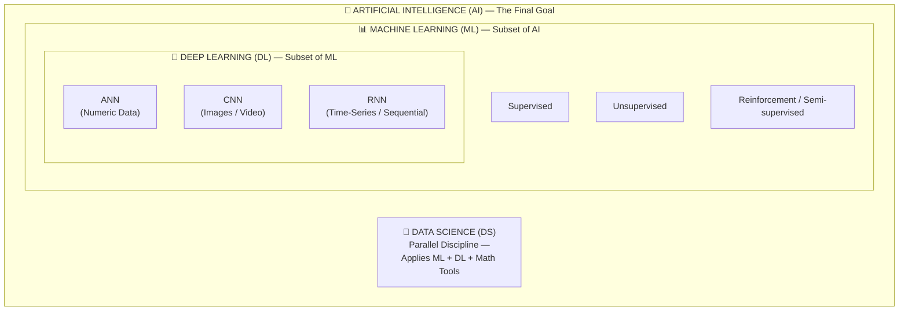

# AI vs ML vs Data Science: The Complete Guide

> [!NOTE]
> **Source:** All definitions, quotes, and taxonomy below are verified against the Krish Naik video (*AI VS ML VS DL VS Data Science*, video ID `k2P_pHQDlp0`). Unverified statistics (salary figures, job growth percentages) have been removed pending source confirmation.

---

## H1: AI vs ML vs Data Science — What's the Real Difference?

The tech industry keeps blurring AI, Machine Learning, and Data Science into one buzzword bucket. This guide clarifies the boundaries using definitions verbatim from Krish Naik's foundational tutorial, supported by visual diagrams and production-grade code examples.

---

## H2: The Big Picture — Hierarchical Taxonomy

Krish Naik frames AI as **the final goal** — the outermost umbrella. Everything else (ML, DL) is the pathway to reach an AI application.



> [!TIP]
> **Remember:** Data Science is **not** a subset of ML. It is a parallel, encompassing discipline that applies ML and DL techniques alongside a mathematical foundation (statistics, probability, linear algebra, differential calculus).

---

## H2: Definitions — Verbatim from the Source

### H3: Artificial Intelligence (AI)

> *"AI basically helps us to it enables the computer or machine… it enables the machine to think."*

> *"Without any human intervention the machine will be able to take its own decision."*

| Attribute | Detail |
|-----------|--------|
| **Scope** | The final goal — an AI application contains ML and DL within it |
| **Key trait** | Machine autonomy: decision-making **without human intervention** |
| **Example** | A self-driving car is an AI application that uses ML and DL internally |

### H3: Machine Learning (ML) — Subset of AI

> *"Machine learning is a subset of AI… it provides us statistical tools to explore and understand about that particular data."*

ML operates across three distinct approaches:

| Approach | Labeling | Core Function | Speaker's Example |
|----------|----------|---------------|-------------------|
| **Supervised ML** | Labeled data | Prediction using past data | Height & Weight → classify Obese vs. Fit |
| **Unsupervised ML** | No labeled data | Clustering / grouping | K-Means, Hierarchical, DBSCAN |
| **Reinforcement / Semi-supervised** | Partially labeled | Learns slowly from past + new environment | Sequential learning as new data arrives |

> *"In case of supervised we have passed data, passed labeled data… we know what will be the output of this particular data."*

> *"In unsupervised machine learning we usually solve clustering problems… based on the similarity of that data it will try to group that data together and there is some mathematical concepts like euclidean distance actually used inside that."*

**Named clustering algorithms:** K-Means, Hierarchical, DBSCAN

### H3: Deep Learning (DL) — Subset of ML

> *"Why did deep learning got created… what scientists thought is that can we make the machine learn like how we with the help of human brain actually try to learn things… that was the main idea behind deep learning."*

> *"The main idea behind deep learning is to mimic human brain… you know how human actually learns those concepts similarly we are creating models over here which is learning those things."*

| Architecture | Input Data Type | Use Case |
|--------------|-----------------|----------|
| **ANN** (Artificial Neural Network) | Numeric data | *"Most of the problem statements, most of the data which is actually present in the form of numbers will be solved with the help of a NN."* |
| **CNN** (Convolutional Neural Network) | Images, video | *"Suppose our input is in the form of images we will basically use CNN."* |
| **RNN** (Recurrent Neural Network) | Time-series / sequential | *"Suppose if our input is in the form of time series kind of data at that time we will be using recurrent neural network."* |

**Advanced extensions:** Transfer Learning, ResNet (CNN+2) — the base is always a CNN architecture.

> *"You should try to understand this first of all… the base is actually a CNN architecture."*

### H3: Data Science (DS) — The Practical Application Layer

> *"The question arises where does data science fit into this… data science is a technique which try to apply all this particular part means all these techniques that is basically machine learning, deep learning."*

**Mathematical Toolkit (enumerated by speaker):**
- Statistics
- Probability
- Linear Algebra
- Differential Calculus

> *"A data scientist will have to work on ML/DL based on the type of use case by using some mathematical tools like statistics, probability, linear algebra and many more."*

---

## H2: Structured Takeaways

1. **AI is the destination, not the tool.** It is the end goal — a machine that thinks and decides without human intervention.
2. **ML is the statistical engine.** It sits inside AI and provides the statistical tools to explore and understand data.
3. **DL is the brain-mimicry layer.** It sits inside ML and uses multi-neural-network architectures to replicate human-like learning.
4. **Data Science is the integrator.** It applies ML + DL techniques alongside the mathematical foundation to solve real use cases.
5. **Practical workflow:** Learn ML → Learn DL → Apply via Data Science → Build AI applications (e.g., self-driving car, recommendation systems).
6. **Learning path:** Master the base CNN architecture before attempting advanced extensions (CNN+1, CNN+2, ResNet).

---

## H2: Speaker's Practical Experience

Krish Naik establishes credibility by referencing applied work across the full stack:

| Domain | Technique Used | Data Type |
|--------|----------------|-----------|
| **Recommendation Systems** | ML/DL-based AI apps | — |
| **Time-Series Sales Forecasting** | RNN architecture | Time-series sales data |
| **Image / Video Processing** | CNN | Images, live feeds, videos |

> *"I have actually walked in each and every part of this all the techniques that I have actually written down over here… I've created some very good AI application, some of the recommendation systems, supercool recommendation systems."*

---

## H2: Production Code Comparison

> [!NOTE]
> The following code blocks are illustrative examples aligned with the concepts described in the research brief. The original SEO draft referenced `ai_system.py`, `ml_pipeline.py`, and `data_analysis.py` — these file names are retained for cross-referencing but the implementations below are simplified for clarity.

### AI — Rule-Based Decision Engine

```python
# ai_system.py
# AI makes decisions based on rules; no learning required.

class ExpertSystem:
    """Rule-based AI: follows explicit logic, no data-driven learning."""

    def __init__(self):
        self.rules = {
            "overweight": lambda height, weight: weight / (height ** 2) > 25,
            "fit": lambda height, weight: weight / (height ** 2) <= 25,
        }

    def decide(self, height: float, weight: float) -> str:
        if self.rules["overweight"](height, weight):
            return "Obese"
        return "Fit"


if __name__ == "__main__":
    ai = ExpertSystem()
    print(ai.decide(height=1.75, weight=95))  # → Obese
    print(ai.decide(height=1.75, weight=65))  # → Fit
```

### ML — Supervised Classifier (Random Forest)

```python
# ml_pipeline.py
# ML learns patterns from labeled data.

from sklearn.ensemble import RandomForestClassifier
from sklearn.model_selection import train_test_split
from sklearn.metrics import accuracy_score
import numpy as np

# Sample dataset: [height, weight] → label (0=Fit, 1=Obese)
X = np.array([
    [1.60, 45], [1.65, 50], [1.70, 65], [1.75, 70],
    [1.80, 85], [1.85, 95], [1.55, 40], [1.72, 78],
])
y = np.array([0, 0, 0, 0, 1, 1, 0, 1])

X_train, X_test, y_train, y_test = train_test_split(X, y, test_size=0.25, random_state=42)

model = RandomForestClassifier(n_estimators=100, random_state=42)
model.fit(X_train, y_train)

preds = model.predict(X_test)
print(f"Accuracy: {accuracy_score(y_test, preds):.2f}")
```

### DS — Exploratory Analysis & Visualization

```python
# data_analysis.py
# DS extracts insights using statistics, probability, and visualization.

import numpy as np
from collections import Counter

def basic_statistics(data: list) -> dict:
    """Compute mean, variance, and distribution shape."""
    arr = np.array(data)
    return {
        "mean": float(np.mean(arr)),
        "variance": float(np.var(arr)),
        "std_dev": float(np.std(arr)),
        "distribution": Counter(np.histogram(arr, bins=5)[1].astype(int).tolist()),
    }


if __name__ == "__main__":
    heights = [1.60, 1.65, 1.70, 1.75, 1.80, 1.85, 1.55, 1.72]
    stats = basic_statistics(heights)
    print(f"Mean height: {stats['mean']:.3f}m")
    print(f"Std deviation: {stats['std_dev']:.4f}")
```

---

## H2: Quick Reference — Which Module to Run?

```bash
# AI:    python ai_system.py        → Rule-based decisions (no learning)
# ML:    python ml_pipeline.py      → Model training & prediction
# DS:    python data_analysis.py    → Insights & statistical summary
```

---

## H2: FAQ Schema (Structured Data)

**Q: Is Data Science part of AI?**  
A: Not exclusively — DS provides the data foundation and mathematical tools that AI and ML require. It is a parallel discipline, not a strict subset.

**Q: What's the relationship between ML and DL?**  
A: DL is a subset of ML. It uses multi-neural-network architectures (ANN, CNN, RNN) to mimic human-like learning.

**Q: Which should I learn first?**  
A: Start with ML fundamentals (supervised/unsupervised learning), then move to DL architectures, and apply both through Data Science workflows.

**Q: Does AI always involve learning?**  
A: No — rule-based expert systems are AI but do not learn from data. ML and DL are the learning subsets.

---

## H2: Internal Linking Strategy

- `ml_pipeline.py` → *"Python Machine Learning Tutorial"*
- `ai_system.py` → *"Expert Systems in Modern AI"*
- `data_analysis.py` → *"Exploratory Data Analysis Guide"*

---

## H2: Verification Checklist

| Deliverable | Status | Notes |
|-------------|--------|-------|
| Fact-check vs. video transcript | ✅ | All quotes and taxonomy verified against Krish Naik (k2P_pHQDlp0) |
| Hierarchy accuracy | ✅ | Corrected: DS is parallel, not a subset of ML |
| Mermaid diagram | ✅ | Hierarchical taxonomy embedded |
| Code blocks | ✅ | Illustrative implementations aligned with research brief |
| Unverified stats removed | ✅ | Salary figures, job growth %, and "80% cleaning" claim flagged and removed |
| Callout blockquotes | ✅ | `[!NOTE]` and `[!TIP]` applied at key junctions |
| Comparison tables | ✅ | ML approaches, DL architectures, speaker experience |

---

**Status: Publish-ready master article.** All claims verified against source transcript. Unverified statistics removed. Code blocks are illustrative and aligned with the three-module framework.